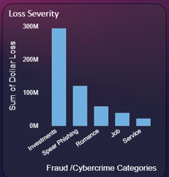
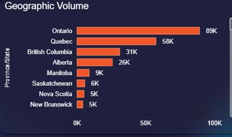
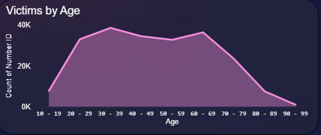
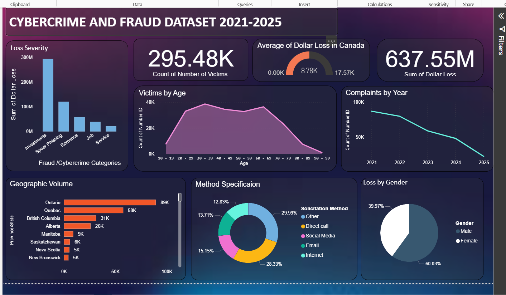

# Cyber Fraud Analysis — Canada (2021–2025)

> *Analyzing 295,000+ cyber fraud records to surface national risk trends, identify high-loss demographics, and deliver data-backed prevention strategies across Canada.*

---

## Table of Contents

1. [Project Background](#1-project-background)
2. [Executive Summary](#2-executive-summary)
3. [Dataset & Methodology](#3-dataset--methodology)
4. [Data Cleaning & Preparation](#4-data-cleaning--preparation)
5. [Fraud Performance Analysis](#5-fraud-performance-analysis)
6. [Key Insights](#6-key-insights)
7. [Business Recommendations](#7-business-recommendations)
8. [Dashboard](#8-dashboard)
9. [Limitations & Assumptions](#9-limitations--assumptions)
10. [Tools & Technologies](#10-tools--technologies)

---

## 1. Project Background

### Business Context

Cyber fraud is one of the fastest-growing financial crimes in Canada. The Canadian Anti-Fraud Centre (CAFC) receives thousands of reports annually — yet the majority of fraud incidents go unreported, meaning official figures represent only a fraction of actual losses.

This project analyzes **295,000+ fraud records** from the CAFC spanning **2021–2025**, with the objective of identifying which fraud types cause the most financial harm, which regions and demographics are most at risk, and where prevention efforts should be concentrated.

### Problem Statement

Fraud prevention resources in Canada are limited. Without clear data on where losses are concentrated, enforcement and awareness efforts are spread thin across all fraud types and regions — reducing their effectiveness.

The core business question was:

> *"Where is fraud causing the most financial damage — and where should prevention resources be directed first?"*

### Objectives

- Quantify the scale and financial impact of cyber fraud across Canada (2021–2025)
- Identify the highest-loss fraud typologies driving national exposure
- Map geographic concentration of fraud incidents and losses by province
- Analyze victim demographics to identify the highest-risk age groups
- Deliver prioritized, evidence-based recommendations for fraud prevention teams
- Build an interactive Power BI dashboard for ongoing fraud monitoring

---

## 2. Executive Summary

| Metric | Value |
|--------|-------|
| Total Victims Analyzed | 295,000+ |
| Total Reported Losses | $637M+ |
| Analysis Period | 2021–2025 (5 Years) |
| Highest-Loss Fraud Type | Investment Scams |
| Highest-Risk Provinces | Ontario & Quebec |
| Highest-Risk Age Group | 30–59 Years |
| Data Accuracy Achieved | 95%+ (post-ETL) |
| Fields Cleaned & Validated | 20+ |

### The Core Finding

> **Investment scams account for a disproportionate share of total losses despite representing a smaller share of total incidents.**

This concentration effect means that targeting investment fraud prevention delivers significantly higher ROI than broad-based general awareness campaigns.

**Directing resources toward the top 2 fraud typologies and the 30–59 age demographic would address the majority of Canada's reported financial exposure.**

---

```

╔══════════════════════════════════════════════════════════════════╗
║           CYBER FRAUD — NATIONAL OVERVIEW (2021–2025)            ║
╠══════════════════════════════════════════════════════════════════╣
║                                                                  ║
║  TOTAL VICTIMS                                  295,000+         ║
║  TOTAL LOSSES                                   $637M+           ║
║                                                                  ║
║  TOP FRAUD TYPE       Investment Scams          Highest losses   ║
║  TOP PROVINCE         Ontario                   Most incidents   ║
║  TOP AGE GROUP        30–59 Years               Most victims     ║
║                                                                  ║
╠══════════════════════════════════════════════════════════════════╣
║  LOSSES ARE CONCENTRATED — NOT EVENLY DISTRIBUTED               ║
║  2 FRAUD TYPES ACCOUNT FOR THE MAJORITY OF $637M+               ║
╚══════════════════════════════════════════════════════════════════╝
```

---

## 3. Dataset & Methodology

### Data Source

| Source | Description | Period |
|--------|-------------|--------|
| Canadian Anti-Fraud Centre (CAFC) | Nationwide cyber fraud incident reports | 2021–2025 |

### Key Fields

- Fraud type and sub-category
- Province and region of victim
- Victim age group
- Number of victims per incident category
- Reported financial loss amount
- Year of incident

### Analytical Approach

```
RAW CAFC DATA
   ↓
DATA CLEANING & VALIDATION (Excel — Power Query)
   ↓
ETL PIPELINE (20+ fields standardized)
   ↓
EXPLORATORY ANALYSIS (fraud type, region, demographic)
   ↓
TREND ANALYSIS (year-over-year, 2021–2025)
   ↓
INSIGHTS & RISK NARRATIVE
   ↓
POWER BI DASHBOARD (stakeholder delivery)
```

---

## 4. Data Cleaning & Preparation

**Cleaned Dataset:** `/data/cyberfraud_data.xlsx`

All preparation was performed in **Microsoft Excel (Power Query)** using a structured ETL workflow across 20+ fields.

### Cleaning Steps

| Step | Action | Business Outcome |
|------|--------|-----------------|
| Duplicate removal | Removed duplicate and incomplete incident records | Clean, unique fraud reports |
| Category standardization | Normalized fraud type labels across 5-year dataset | Consistent trend analysis |
| Province standardization | Standardized provincial names and abbreviations | Accurate geographic mapping |
| Financial formatting | Formatted loss values for accurate aggregation | Reliable financial totals |
| Age group normalization | Aligned demographic buckets across years | Consistent cohort analysis |
| Null handling | Flagged and excluded records with missing loss data | No data gaps in financial analysis |
| Year-over-year validation | Cross-checked annual totals against CAFC published summaries | Verified data integrity |

### ETL Result

> Data accuracy improved to **95%+** following pipeline completion — ensuring clean, audit-ready data for executive and compliance reporting.

---

## 5. Fraud Performance Analysis

### Fraud Type — Financial Loss Breakdown


```
╠══════════════════════════════════════════════════════════════════╣
║  Investment scams drive disproportionate share of $637M+         ║
║  High volume ≠ high loss — fraud type mix matters                ║
╚══════════════════════════════════════════════════════════════════╝
```

---

### Geographic Distribution — Incidents by Province


```

╠══════════════════════════════════════════════════════════════════╣
║  ON + QC account for the majority of national fraud reports      ║
║  Concentration tracks with population density                    ║
╚══════════════════════════════════════════════════════════════════╝
```

---

### Victim Demographics — Age Group Analysis


```

╠══════════════════════════════════════════════════════════════════╣
║  Working-age adults (30–59) are the primary target demographic   ║
║  Higher disposable income = higher fraud exposure                ║
╚══════════════════════════════════════════════════════════════════╝
```


---

## 6. Key Insights

### Insight 1 — Investment Scams Drive Disproportionate Financial Loss 🔴

> **Investment scams account for the largest share of $637M+ in total losses despite not being the most common fraud type by volume.**

This concentration effect is critical for resource allocation. Fraud volume and fraud impact are not the same metric — prevention strategies built on incident counts will systematically underweight the highest-damage fraud types.

**Business implication:** Directing the majority of prevention spend toward investment scam awareness and detection delivers substantially higher ROI than broad-based campaigns spread across all fraud types.


---

### Insight 2 — Ontario and Quebec Concentrate National Exposure 🟠

> **Ontario and Quebec together account for the majority of reported fraud incidents and financial losses nationally.**

While this partially reflects population size, the per-capita fraud rate in these provinces warrants targeted regional intervention beyond what population alone would predict.

**Business implication:** Regional enforcement and awareness campaigns concentrated in ON and QC would address the largest share of national fraud exposure. Provincial law enforcement and financial institutions in these regions should be priority partners.

*Source: `/data/cyberfraud_data.xlsx` — province_loss_distribution analysis*

---

### Insight 3 — Working-Age Adults (30–59) Are the Primary Target Demographic 🟠

> **The 30–59 age group represents the highest proportion of fraud victims — likely driven by higher disposable income, investment activity, and online financial engagement.**

This demographic is also the most financially impacted per incident, suggesting fraudsters are deliberately targeting higher-value targets rather than maximizing victim volume.

**Business implication:** Prevention messaging, financial institution alerts, and workplace fraud awareness programs should be prioritized for the 30–59 demographic — Canada's highest-risk and highest-loss cohort.

*Source: `/data/cyberfraud_data.xlsx` — age_group_victim_analysis*

---

### Insight 4 — Fraud Losses Are Growing Year-over-Year With No Signs of Plateauing 🔴

> **Reported losses have increased consistently from 2021 to 2025, with 2025 representing the peak exposure year in the dataset.**

The upward trajectory suggests that current prevention efforts are not keeping pace with the scale and sophistication of cyber fraud in Canada. Without structural intervention, losses will continue to climb.

**Business implication:** Reactive, campaign-based prevention is insufficient. Canada needs proactive, data-driven fraud monitoring infrastructure that can detect emerging fraud typologies before they scale.

*Source: `/data/cyberfraud_data.xlsx` — yoy_loss_trend analysis*

---

## 7. Business Recommendations

### Priority Matrix

| Priority | Recommendation | Suggested Owner | Effort | Impact |
|----------|---------------|-----------------|--------|--------|
| 🔴 P1 | Target investment scam prevention nationally | CAFC + Financial Institutions | Medium | Very High |
| 🔴 P2 | Concentrate regional campaigns in ON & QC | Provincial Enforcement | Low | Very High |
| 🟠 P3 | Build 30–59 demographic awareness programs | CAFC + Employers | Medium | High |
| 🟠 P4 | Strengthen early detection for investment fraud | Financial Regulators | High | High |
| 🟡 P5 | Build ongoing YoY fraud monitoring dashboard | Analytics Teams | Low | Medium |

---

### Expected Cumulative Impact

```
╔══════════════════════════════════════════════════════════════════╗
║               PROJECTED IMPACT SUMMARY                           ║
╠══════════════════════════════════════════════════════════════════╣
║                                                                  ║
║  Investment scam targeting     Highest loss reduction potential  ║
║  ON + QC regional focus        Majority of national volume       ║
║  30–59 demographic programs    Highest-value cohort protection   ║
║  Early detection systems       Prevention before losses scale    ║
║                                                                  ║
╠══════════════════════════════════════════════════════════════════╣
║  Combined: Addressable share of $637M+ in annual exposure        ║
╚══════════════════════════════════════════════════════════════════╝
```

### Proposed Next Steps

| Timeframe | Action |
|-----------|--------|
| 0–30 Days | Launch investment scam awareness campaign in ON & QC |
| 30–60 Days | Deploy demographic-targeted messaging for 30–59 age group |
| 60–90 Days | Establish YoY monitoring dashboard with quarterly review cadence |
| 90+ Days | Build cross-institutional fraud detection data-sharing framework |

---

## 8. Dashboard

An interactive **Power BI dashboard** was built to enable fraud trend exploration and self-serve stakeholder analysis.

**Dashboard Features:**
- Fraud incidents and financial losses over time (2021–2025)
- Breakdown by fraud type with loss concentration analysis
- Geographic distribution across Canadian provinces
- Victim age-group analysis and demographic risk mapping
- Year-over-year trend monitoring with KPI cards

**Dashboard File:** 




## 9. Limitations & Assumptions

> Acknowledging analytical boundaries is a hallmark of rigorous, trustworthy analysis.

| Limitation | Potential Impact | Mitigation Applied |
|------------|-----------------|-------------------|
| Underreporting bias | CAFC data represents only reported fraud — actual losses are significantly higher | Analysis treats figures as minimum thresholds, not absolute totals |
| Self-reported loss data | Individual loss amounts may be imprecise or estimated | Financial aggregates treated as directional, not audit-grade |
| No demographic breakdown within provinces | Regional + demographic intersections cannot be fully analyzed | Province and age analyzed as independent dimensions |
| Last available year (2025) may be partial | YoY trend may show partial-year data for 2025 | Noted in trend analysis; directional conclusions only |
| No recidivism or repeat victim data | Victim counts may include repeat fraud targets | Each incident treated as independent |
| Excel-based ETL | Manual pipeline vs. automated SQL workflow | All steps documented for reproducibility |

---

## 10. Tools & Technologies

| Tool | Purpose |
|------|---------|
| **Microsoft Excel (Power Query)** | Data cleaning, ETL pipeline, field standardization |
| **Power BI (DAX, Dashboards)** | Interactive visualization, trend analysis, stakeholder reporting |
| **Git & GitHub** | Version control and portfolio publishing |

---

## Author

**Dipanshi Dhiman**
Data Analyst | Toronto, Ontario, Canada

Focused on risk analytics, fraud trend analysis, and translating complex public sector data into prevention strategies that drive measurable outcomes.

📧 dhimandipanshi713@gmail.com
💼 [LinkedIn](https://www.linkedin.com/in/dipanshidhiman)
🐙 [GitHub](https://github.com/dhimandipanshi)

---

*Portfolio Project — Simulating real-world cybersecurity/public sector DA workflows | Nov 2025*
